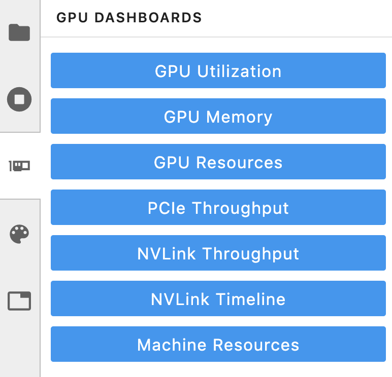
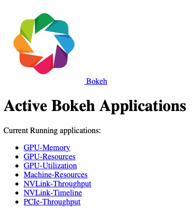

# GPU Dashboards in Jupyter Lab

- **Authors**: 
	- Jacob Tomlinson
	- Rick Zamora
- **Last Update:** 8/21/2019

**Note:** *NVDashboard is under heavy development. There is no guarentee that the code snippents or dashboard screenshots shared here will work with current/future versions.*

## Introduction

We are excited to announce [NVDashboard](https://github.com/jacobtomlinson/jupyterlab-nvdashboard), a new dashboard server and Jupyter-Lab extension for the real-time visualization of NVIDIA GPU diagnostics.  NVDashboard is a great way for all GPU users to monitor system resources, but it is especially valuable for users of [RAPIDS](https://rapids.ai/), NVIDIA’s open-source suite of GPU-accelerated data-science software libraries.

Given the computational intensity of modern data-science workflows, it is absolutely critical for the underlying software to utilize system resources efficiently.  The overall execution time can depend on a number of inter-dependent factors, like GPU utilization, memory consumption, and inter-process communication. As illustrated in **Fig. 1**, NVDashboard makes it simple to track critical GPU diagnostics, including:

- GPU-compute utilization
- GPU-Memory consumption
- PCIe throughput
- NVLink throughput

--


**Fig. 1** *The NVDashboard Jupyter-Lab extension in action.  The GPU dashboards are shown along the right-hand side of the screen, while two [dask-labextension](https://github.com/dask/dask-labextension) dashboards are shown on the bottom left).*

--


## Using NVDashboard


The `nvdashboard` package is available on [PyPI](https://pypi.org/project/jupyterlab-nvdashboard/), and consists of two basic components:

- **Bokeh Server**:  The server component leverages the wonderful [Bokeh visualization library](https://bokeh.pydata.org/en/latest/) to display and update GPU-diagnostic dahsboards in real time. The desired hardware metrics are accessed with [PyNVML](https://pypi.org/project/pynvml/), an open-source python package composing wrappers for the NVIDIA Mangement Library (NVML).  For this reason, NVDashboard can be modified/extended to display any queriable GPU metric accessible through NVML.

- **Jupyter-Lab Extension**:  The Jupyter-Lab extension allows you to **embed** the GPU-diagnostic dashboards as movable windows within an interactive [Jupyter-Lab](https://jupyterlab.readthedocs.io/en/stable/) environment.


### The Jupyter-Lab Extension

The practice of directly querying hardware metrics is often the best way to validate efficient run-time behavior, and this is especially true for interactive iPython-notebook users.  In this case, the developement process is often iterative, and improper GPU utilization can result in huge productivity losses.  As shown in **Fig. 1**, NVDashboard makes it easy for Jupyter-Lab users to visualize resource utilization right alongside their code.

To install both the server and client-side components, run the following in your terminal:

```
pip install jupyterlab-nvdashboard
jupyter labextension install jupyterlab-nvdashboard
```

After NVDashborad is installed, a "GPU Dashboards" menu should be visible along the lefthand side of your Jupyter-Lab environment (see **Fig. 4**).  Clicking on one of these buttons should automatically add a movable window, with a real-time display of the desired dashboard.

--



**Fig. 4** *Main menu for the Jupyter-Lab extension.*

--

It is important to clarify that NVDashboard will automatically monitor the GPU resources for the entire machine, not only those being used by the local Jupyter environment. For this reason, the Jupyter-Lab Extension can certainly be used for non-Python/notebook developement. For example, in **Fig. 5**, the "NVLink Timeline" and "GPU Utilization" dashboards are being used within a Jupyter-Lab environment to monitor a multi-GPU deep-learning workflow that has been executed from the command line. 

--


**Fig. 5** *The "NVLink Timeline" dashboard being used with Jupyter Lab.*

--


### The Bokeh Server

While the Jupyter-Lab extension is certainly ideal for fans of iPython/notebook-based developement, other GPU users can also access the dashboards using a stand-alone Bokeh server.  This can be accomplished by cloning the [jupyterlab-nvdashboard](https://github.com/jacobtomlinson/jupyterlab-nvdashboard/issues/13) repository, and simply executing the `server.py` script (e.g. `python jupyterlab_nvdashboard/server.py 5000`).

After starting the Bokeh server, GPU dashboards can be accessed by opening the appropriate url in a standard web browser (e.g. `http://<ip-address>:5000`). As shown in **Fig. 2**, the main menu will list all dashboards available in NVDashboard. 

--



**Fig. 2** *The main menu for the Bokeh-server component of NVDashboard.*

--

For example, selecting the "GPU-Resources" link will open the dashboard shown in **Fig. 3**, which summarizes the utilization of various GPU resources using aligned timeline plots. 

--


**Fig. 3** *The "GPU Resources" dashboard being used outside of Jupyter Lab.*

--


## Bonus: Implementing Custom NVDashboards

The existing `nvdashboard` package provides a number of useful GPU-resource dashboards.  However, it is fairly straightforward to modify existing dashboards and/or add completely new ones. In order to do this, you simply need to leverage PyNVML and Bokeh.

### PyNVML Basics

PyNVML is a python wrapper for the [NVIDIA Management Library (NVML)](https://developer.nvidia.com/nvidia-management-library-nvml), which is a C-based API for monitoring and managing various states of NVIDIA GPU devices. NVML is directly used by the better-known [NVIDIA System Management Interface](https://developer.nvidia.com/nvidia-system-management-interface) (`nvidia-smi`). According to the NVIDA developer site, NVML provides access to the following query-able states (in additional to modifiable states not discussed here):

- **ECC error counts**: Both correctable single bit and detectable double bit errors are reported. Error counts are provided for both the current boot cycle and for the lifetime of the GPU.
- **GPU utilization**: Current utilization rates are reported for both the compute resources of the GPU and the memory interface.
- **Active compute process**: The list of active processes running on the GPU is reported, along with the corresponding process name/id and allocated GPU memory.
- **Clocks and PState**: Max and current clock rates are reported for several important clock domains, as well as the current GPU performance state.
- **Temperature and fan speed**: The current core GPU temperature is reported, along with fan speeds for non-passive products.
- **Power management**: For supported products, the current board power draw and power limits are reported.
- **Identification**: Various dynamic and static information is reported, including board serial numbers, PCI device ids, VBIOS/Inforom version numbers and product names.

Although several different python wrappers for NVML currently exist, we use the [PyNVML](https://github.com/gpuopenanalytics/pynvml) package hosted by GoAi on GitHub. This version of PyNVML uses `ctypes` to wrap most of the NVML C API.  NVDashboard utilizes only a small subset of the API needed to query real-time GPU-resource utilization, including:

- `nvmlInit()`: Initialize an NVML profiling session
- `nvmlShutdown()`: Finalize an NVML profiling session
- `nvmlDeviceGetCount()`: Get the number of available GPU devices
- `nvmlDeviceGetHandleByIndex()`: Get a handle for a device (given an integer index)
- `nvmlDeviceGetMemoryInfo()`: Get a memory-info object (given a device handle)
- `nvmlDeviceGetUtilizationRates()`: Get a utlization-rate object (given a device handle)
- `nvmlDeviceGetPcieThroughput()`: Get a PCIe-trhoughput object (given a device handle)
- `nvmlDeviceGetNvLinkUtilizationCounter()`: Get an NVLink utilization counter (given a device handle and link index)

In the current version of PyNVML, the python function names are usually chosen to exactly match the C API. For example, to query the current GPU-utilization rate on every available device, the code would look something like this:

```python
In [1]: from pynvml import *
In [2]: nvmlInit()
In [3]: ngpus = nvmlDeviceGetCount()
In [4]: for i in range(ngpus):
   ...:     handle = nvmlDeviceGetHandleByIndex(i)
   ...:     gpu_util = nvmlDeviceGetUtilizationRates(handle).gpu
   ...:     print('GPU %d Utilization = %d%%' % (i, gpu_util))
   ...:
GPU 0 Utilization = 43%
GPU 1 Utilization = 0%
GPU 2 Utilization = 15%
GPU 3 Utilization = 0%
GPU 4 Utilization = 36%
GPU 5 Utilization = 0%
GPU 6 Utilization = 0%
GPU 7 Utilization = 11%
```

Note that, in addition to the GitHub repository, PyNVML is also hosted on [PyPI](https://pypi.org/project/pynvml/) and [Conda Forge](https://anaconda.org/conda-forge/pynvml).

### Dashboard Code

In order to modify/add a GPU dashboard, it is only nessary to modify two files (`jupyterlab_bokeh_server/server.py` and `jupyterlab_nvdashboard/apps/gpu.py`).  Most of the PyNVML and bokeh code needed to add/modify a dashboard will be in `gpu.py`.  It is only necessary to modify `server.py` in the case that you are adding or changing a menu/display name. In this case, the new/modified name must be specified in `routes` dictionary (with the key equal to the desired name, and the value equal to the corresponding dashboard definition):

```python
routes = {
    "/GPU-Utilization": apps.gpu.gpu,
    "/GPU-Memory": apps.gpu.gpu_mem,
    "/GPU-Resources": apps.gpu.gpu_resource_timeline,
    "/PCIe-Throughput": apps.gpu.pci,
    "/NVLink-Throughput": apps.gpu.nvlink,
    "/NVLink-Timeline": apps.gpu.nvlink_timeline,
    "/Machine-Resources": apps.cpu.resource_timeline,
}
```

In order for the server to constantly refresh the pyNVML data used by the bokeh applications, we use bokeh's `ColumnDataSource` class to define the *source* of data in each of our plots. The `ColumnDataSource` class allows you to pass an `update` function for each type of data, which can be called within a dedicated callback function (`cb`) for each application.  For example, the existing `gpu` application is defined like this:


```python
def gpu(doc):
    fig = figure(title="GPU Utilization", sizing_mode="stretch_both", x_range=[0, 100])

    def get_utilization():
        return [
            pynvml.nvmlDeviceGetUtilizationRates(gpu_handles[i]).gpu
            for i in range(ngpus)
        ]

    gpu = get_utilization()
    y = list(range(len(gpu)))
    source = ColumnDataSource({"right": y, "gpu": gpu})
    mapper = LinearColorMapper(palette=all_palettes["RdYlBu"][4], low=0, high=100)

    fig.hbar(
        source=source,
        y="right",
        right="gpu",
        height=0.8,
        color={"field": "gpu", "transform": mapper},
    )

    fig.toolbar_location = None

    doc.title = "GPU Utilization [%]"
    doc.add_root(fig)

    def cb():
        source.data.update({"gpu": get_utilization()})

    doc.add_periodic_callback(cb, 200)
```

Note that the real-time update of PyNVML GPU-utilization data is performed within the `source.data.update()` call.  Whith the necessary `ColumnDataSource` logic in place, the standard `gpu` definition (above) can be modified in many ways.  For example, you can swap x and y axes, specify a different color paleette, or even change the figure from an `hbar` to something else entirely.  Users should also feel free to [open a pull request](https://github.com/jacobtomlinson/jupyterlab-nvdashboard/pulls) to contribute valuable improvements/additions - Community engagement is certainly encouraged!
